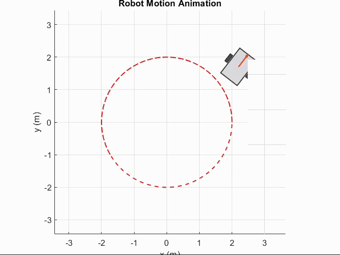

# Nonlinear Trajectory Tracking Control of a Differential-Drive Mobile Robot

This repository contains a MATLAB simulation project for nonlinear trajectory tracking of a differential-drive mobile robot under payload variation and external disturbances.

The project was developed as a reproduction-oriented nonlinear control study and includes implementations of feedback linearization, backstepping-based control, fuzzy sliding-mode control, and an adaptive sliding-mode variant.


## Demo

<p align="center">
  
</p>

The animation shows the differential-drive robot tracking a circular reference trajectory during the MATLAB simulation.


## Project Overview

The simulated robot is a differential-drive mobile robot with two independently actuated wheels. Its kinematic and dynamic equations are implemented directly in MATLAB, and the robot is required to track a circular reference trajectory.

The simulation includes:

- Nonholonomic differential-drive kinematics
- A nonlinear dynamic model
- Time-varying payload mass and rotational inertia
- Sinusoidal external disturbances
- Circular trajectory tracking
- Wheel-torque computation
- Tracking-error analysis
- Robot-motion animation
- Sliding-surface and phase-plane analysis

## Implemented Controllers

### 1. Feedback Linearization

Implemented in:

```text
FL_Main.m
```

This script applies a feedback-linearization-based dynamic controller together with proportional, integral, and derivative correction terms for velocity tracking.

Main outputs include:

- Robot and reference trajectories
- Linear and angular velocities
- Left- and right-wheel torques
- Position and orientation tracking errors

### 2. Backstepping-Based Control

Implemented in:

```text
backstepping.m
```

The script uses a kinematic backstepping controller to generate desired linear and angular velocities. A dynamic control layer is then used to track these commands in the presence of disturbances and parameter changes.

Main outputs include:

- Trajectory tracking
- Actual linear and angular velocities
- Wheel torques
- Tracking errors
- Robot-motion animation

### 3. Fuzzy Sliding-Mode and Adaptive Sliding-Mode Control

Implemented in:

```text
AFSMC.m
```

The first part of this script implements a fuzzy sliding-mode controller. A Mamdani fuzzy inference system adjusts the switching gain according to the linear velocity error.

The second part evaluates an adaptive sliding-mode variant and compares it with the baseline fuzzy sliding-mode controller.

Additional outputs include:

- Baseline and adaptive trajectory comparison
- Tracking-error comparison
- Wheel-torque comparison
- Sliding-surface components
- Sliding-surface phase plots
- Position-error phase portraits
- Adaptive gain histories

## Robot and Simulation Parameters

| Parameter | Value | Description |
|---|---:|---|
| Wheel radius | `0.1 m` | Radius of each wheel |
| Wheel-base parameter | `0.8 m` | Distance parameter used in the kinematic model |
| Center-of-mass offset | `0.5 m` | Geometric offset |
| Robot mass | `300 kg` | Main body mass |
| Left-wheel inertia | `20 kg.m^2` | Wheel inertia |
| Right-wheel inertia | `20 kg.m^2` | Wheel inertia |
| Initial payload mass | `100 kg` | Used before `t = 4 s` |
| Final payload mass | `200 kg` | Used from `t = 4 s` |
| Initial rotational inertia | `200 kg.m^2` | Used before `t = 4 s` |
| Final rotational inertia | `250 kg.m^2` | Used from `t = 4 s` |
| Simulation duration | `10 s` | Total simulation time |
| Integration step | `0.001 s` | Fixed numerical step |

The disturbance applied to the wheel dynamics is:

```matlab
tau_d = [0; 0; 0; 4*sin(t); 4*sin(t)];
```

The payload mass and rotational inertia change at four seconds:

```matlab
if t < 4
    mc = 100;
    I = 200;
else
    mc = 200;
    I = 250;
end
```

## Reference Trajectory

The desired path is a circle with radius two:

```matlab
ref_x = 2*cos(t);
ref_y = 2*sin(t);
```

The corresponding reference linear and angular velocities are:

```matlab
vr = 2;
wr = 1;
```

## Repository Structure

```text
.
├── AFSMC.m
├── backstepping.m
├── FL_Main.m
└── README.md
```

The MATLAB scripts are self-contained and preserve the original project implementation.

## Requirements

- MATLAB R2023b or a compatible newer release
- Fuzzy Logic Toolbox for `AFSMC.m`
- MATLAB support for `wrapToPi`
- A MATLAB installation capable of writing MPEG-4 video through `VideoWriter`

## Running the Simulations

Clone or download the repository, open MATLAB, and set the repository folder as the current working directory.

Run one of the following commands.

### Feedback Linearization

```matlab
run('FL_Main.m')
```

### Backstepping

```matlab
run('backstepping.m')
```

### Fuzzy and Adaptive Sliding-Mode Control

```matlab
run('AFSMC.m')
```

Each script clears the workspace, runs the full simulation, and generates its corresponding figures.

## Generated Results

Depending on the selected script, the simulation generates several figures, including:

- Actual and reference robot trajectories
- Linear and angular velocity responses
- Wheel-torque histories
- Longitudinal, lateral, and orientation errors
- Sliding-surface responses
- Phase-plane plots
- Baseline-versus-adaptive comparisons
- Adaptive gain evolution

The scripts that include animation use:

```matlab
saveVideo = true;
videoFile = 'robot_animation.mp4';
```

Running another script may overwrite an existing file with the same name.

## Numerical Method

The robot states are propagated using a fixed-step Euler integration procedure with:

```matlab
tspan = 0:0.001:10;
```

The sliding-mode error integral is updated numerically during the simulation. In the fuzzy sliding-mode implementation, trapezoidal integration is used for the accumulated velocity error.

## Control Architecture

The overall simulation follows a two-layer structure:

1. A kinematic tracking controller calculates desired linear and angular velocities from the robot pose error.
2. A dynamic controller calculates the wheel torques required to track those velocity commands.

The pose error is transformed from the inertial coordinate frame to the robot body frame before the velocity commands are calculated.

## Notes

- The repository contains the original implementation used for the project.
- Controller parameters were selected for the simulated robot and the specified reference trajectory.
- Results are simulation-based and have not been validated on a physical robot.
- The scripts use relatively large robot mass and torque values because they follow the parameterization used in the original study.
- The project is intended for educational, research, and portfolio purposes.

## Background

This project was inspired by nonlinear trajectory-tracking research combining backstepping, sliding-mode control, and fuzzy gain adjustment for differential-drive mobile robots.

The implementation also includes feedback-linearization and adaptive-control variants for comparison under the same robot model, disturbance, reference trajectory, and payload-change scenario.

## Author

**Amirhossein Alishahnejad**

Nonlinear control, mobile robotics, reinforcement learning, and autonomous robot navigation.

## Citation

When referring to this repository in academic or technical work, please cite the repository URL and the author name.

## License

This project is licensed under the MIT License. See the [LICENSE](LICENSE) file for details.
